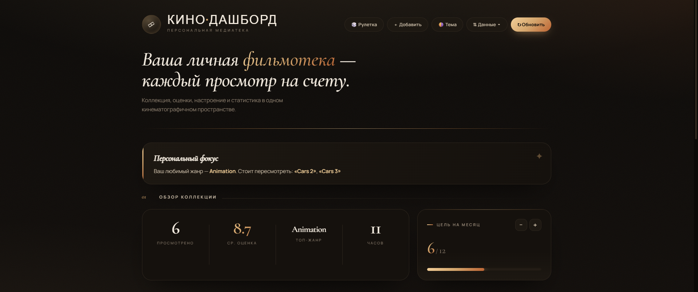
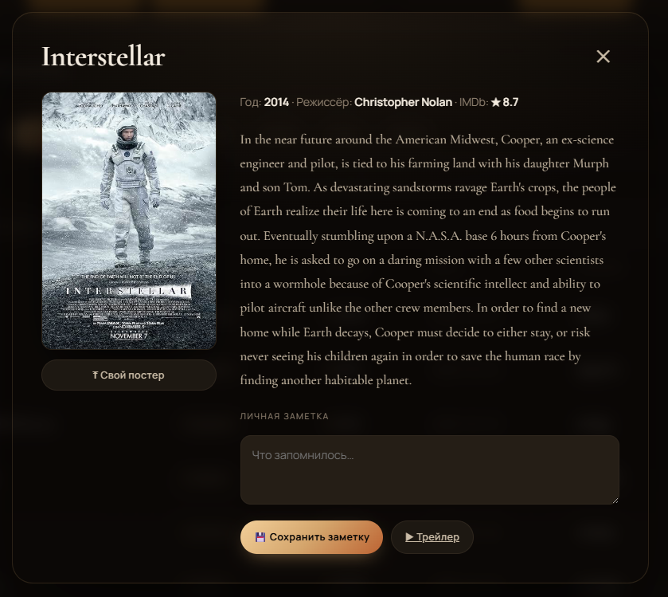
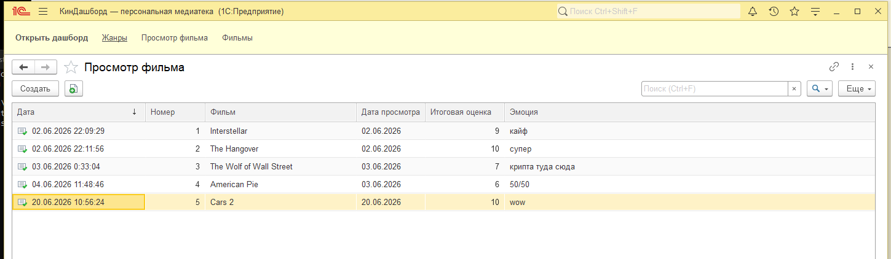
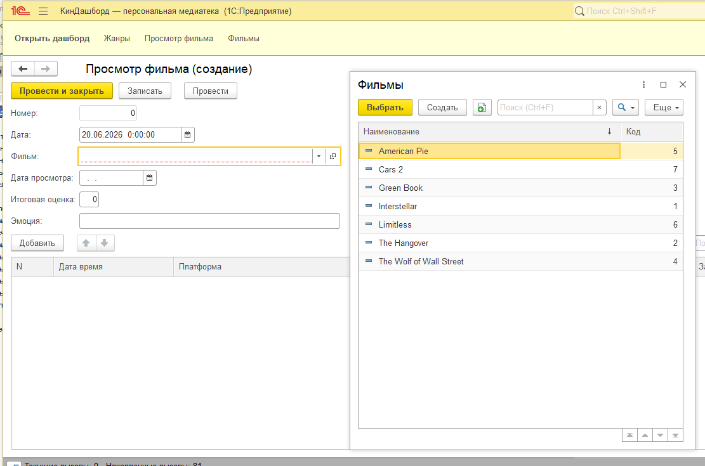
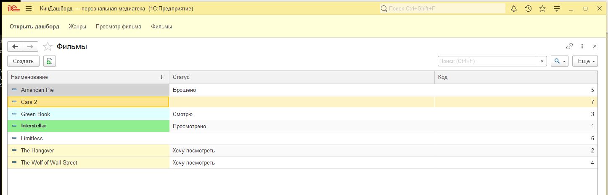

# 🎬 КиноДашборд

**Учёт просмотренных фильмов на стыке корпоративной системы и веб-аналитики**
1С:Предприятие · Flask · SQLite · OMDB API

[](https://1c.ru/)
[](https://www.python.org/)
[](https://flask.palletsprojects.com/)
[](https://www.sqlite.org/)
[](https://www.chartjs.org/)
[](https://www.omdbapi.com/)
[](LICENSE)

[](docs/screenshots/00-dashboard.png)

---

## ✨ Что это

Связка из двух систем для учёта и анализа просмотренных фильмов.

**1С:Предприятие** выступает корпоративным фронтендом ввода данных: оператор фиксирует просмотр документом, а при проведении конфигурация сама отправляет данные REST-запросом во внешний сервис. **Flask** принимает эти данные, хранит их в SQLite и превращает в кинематографичный веб-дашборд — со статистикой, графиками, тепловой картой и обогащением из OMDB (постеры, рейтинг IMDb, описание, трейлер).

Веб-часть полностью автономна: фильмы можно добавлять, редактировать и удалять прямо с сайта, без запущенной 1С. Это делает проект демонстрацией сразу двух компетенций — интеграции с корпоративной платформой и самостоятельной веб-разработки на Python.

## 🏗️ Как это устроено

```
┌──────────────────────┐     POST /api/viewing      ┌────────────────────┐
│   1С:Предприятие     │ ─────────────────────────► │     Flask (app.py) │
│  «КиноДашборд»       │      (HTTP, при            │   REST API + UI    │
│                      │       проведении           │                    │
│ • Справочник Фильмы  │       документа)           │ ┌────────────────┐ │
│ • Документ Просмотр  │                            │ │   SQLite БД    │ │
└──────────────────────┘                            │ └────────────────┘ │
                                                     │          ▲          │
                                  обогащение данных  │          │          │
              ┌──────────────┐    (постер, рейтинг,  │   ┌──────┴──────┐   │
              │  OMDB API    │ ◄────трейлер) с кэшем──┼── │  /api/fill  │   │
              └──────────────┘                        │   └─────────────┘   │
                                                     │                      │
                                                     │   🌐 Веб-дашборд     │
                                                     │   статистика,        │
                                                     │   графики, поиск      │
                                                     └────────────────────┘
```

1. В **1С:Предприятие** настроена конфигурация «КиноДашборд»: справочник **Фильмы** со статусами (`хочу посмотреть` / `смотрю` / `просмотрено` / `брошено`) и документ **Просмотр фильма** с датой, оценкой и эмоцией.
2. При проведении документа 1С отправляет просмотр запросом `POST /api/viewing` во Flask.
3. Flask сохраняет данные в **SQLite** и при необходимости дозапрашивает описание, постер, рейтинг и трейлер из **OMDB**, кэшируя ответ в БД.
4. Результат отображается на **веб-дашборде**: агрегаты, графики Chart.js, тепловая карта активности, рекомендации.

## 🚀 Возможности

- **🎞 Учёт просмотров** — добавление, редактирование и удаление записей прямо в вебе.
- **🔗 Интеграция с 1С** — приём проведённых документов через REST (`POST /api/viewing`).
- **🪄 Обогащение из OMDB** — описание, постер, рейтинг IMDb и трейлер по названию, с кэшированием в БД.
- **📊 Статистика** — средний рейтинг, разбивка по жанрам и эмоциям, тепловая карта активности по дням недели.
- **📈 Графики (Chart.js)** — распределение по жанрам и динамика оценок.
- **🎯 Рекомендации** — подсказки на основе любимого жанра.
- **🖼 Свои постеры и заметки** — загрузка собственного постера и личных комментариев к фильму.
- **🔄 Импорт / экспорт** — выгрузка в CSV, бэкап в JSON, импорт просмотров из CSV.
- **🌗 Тёмная / светлая тема** — кинематографичный UI с собственной типографикой.

**Карточка фильма** — постер, рейтинг IMDb, описание и трейлер, подтянутые из OMDB:

[](docs/screenshots/01-dashboard.png)

## 🛠️ Стек

| Слой           | Технологии                                         |
| -------------- | -------------------------------------------------- |
| Источник данных| 1С:Предприятие (конфигурация «КиноДашборд»)         |
| Backend        | Python, Flask, REST API                            |
| Хранилище      | SQLite                                             |
| Внешние данные | OMDB API (с кэшированием)                           |
| Frontend       | HTML + CSS + Vanilla JS (без фреймворков)           |
| Визуализация   | Chart.js                                           |
| Форматы обмена | REST/JSON, CSV                                      |

## ⚡ Быстрый старт

> Требуется Python 3.10+. Интеграция с 1С опциональна — веб-дашборд работает автономно.

```bash
git clone https://github.com/Aristeyy/1c-flask-movie-tracker.git
cd 1c-flask-movie-tracker

python -m venv venv
source venv/bin/activate        # Windows: venv\Scripts\activate

pip install -r requirements.txt
```

Создайте `.env` на основе примера и впишите ключ OMDB (бесплатно на [omdbapi.com](https://www.omdbapi.com/apikey.aspx)):

```bash
cp .env.example .env
# OMDB_API_KEY=ваш_ключ
```

Запуск:

```bash
python app.py
```

Дашборд откроется на <http://127.0.0.1:5000>. База `movies.db` создаётся автоматически при первом старте.

## 🧩 Конфигурация 1С

Выгрузка информационной базы лежит в [`kinodashboard.dt`](kinodashboard.dt) (конфигурация + данные). Чтобы её открыть:

1. **1С:Предприятие** → **Добавить** ИБ → **Создание новой** → **Загрузка из файла**.
2. Укажите путь к `kinodashboard.dt`.
3. Откройте базу в режиме «1С:Предприятие» — конфигурация уже настроена на отправку данных во Flask по адресу `http://localhost:5000`.

**Журнал документов «Просмотр фильма»** — все просмотры с оценками и эмоциями:

[](docs/screenshots/01-viewings-list.png)

**Создание документа просмотра** с выбором фильма из справочника:

[](docs/screenshots/02-add-viewing.png)

**Справочник «Фильмы»** со статусами просмотра:

[](docs/screenshots/03-movies-catalog.png)

## 🔌 API

| Метод  | Путь                      | Описание                  |
| ------ | ------------------------- | ------------------------- |
| POST   | `/api/viewing`            | приём просмотра от 1С     |
| GET    | `/api/movies`             | список просмотров         |
| POST   | `/api/movies`             | добавить фильм вручную    |
| PATCH  | `/api/movies/<id>`        | изменить запись           |
| DELETE | `/api/movies/<id>`        | удалить запись            |
| POST   | `/api/movies/<id>/poster` | загрузить постер          |
| GET    | `/api/stats`              | агрегированная статистика |
| GET    | `/api/recommend`          | рекомендации по жанру     |
| GET    | `/api/fill?name=...`      | данные из OMDB (с кэшем)  |
| GET    | `/api/export/csv`         | экспорт в CSV             |
| GET    | `/api/export/json`        | бэкап в JSON              |
| POST   | `/api/import/csv`         | импорт просмотров из CSV  |

## 🗂️ Структура

```
1c-flask-movie-tracker/
├── app.py                  # Flask-сервер и REST API
├── templates/
│   └── index.html          # UI дашборда
├── static/
│   └── posters/            # загруженные пользователем постеры
├── docs/
│   └── screenshots/        # скриншоты дашборда и конфигурации 1С
├── kinodashboard.dt        # выгрузка информационной базы 1С
├── requirements.txt
├── .env.example
└── .gitignore
```

## 📄 Лицензия

[MIT](LICENSE)

---

Pet-проект на стыке 1С-разработки и Python-веб-аналитики · автор [@Aristeyy](https://github.com/Aristeyy)